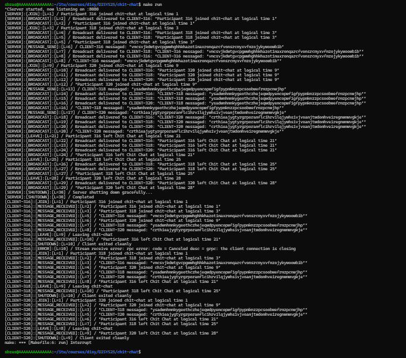

# Chit Chat execution instructions

## 1. Getting ready

Compile `chit_chat.proto` to generate the Go files that let us build our gRPC server and clients instances.  

From the root folder (`chit-chat/`) run the following command on your terminal: 

`cd grpc && protoc --go_out=. --go-grpc_out=. chit_chat.proto`

## 2. Running the service

Go back to the root folder, and take advantage of the Makefile to start execution of all instances (both server and clients).

This all can be performed by running: 

`cd .. && make run`

Let it run for 20 seconds to get all logs. 

By default, the amount of clients is 3. However, you can specify `n` clients you want to create by simply modifying the command above like this: `cd .. && make run CLIENTS=n`

> **Note:** Alternatively, you can also first run the server manually: `cd ../server && go run main.go` and then open several separate terminal windows (for the clients, so as many as you wish) to run, making sure you are in the `clients/` folder: `go run main.go`. 
This is of course a bit tedious to do, which is why we built the Makefile and recommend sticking with it. 

## 3. Inspecting logs
Running the above command, will create `.log` files for each instance in its respective folder.

Moreover, it will properly log events from both server and clients directly to your terminal **once server execution is interrupted (with Ctrl+C or Cmd+C)** grouped by instance name (see screenshot below). 

Thus, you can either see the logs being saved in real time to their corresponding files or wait until you interrupt execution and see all logs in your terminal.

The server is always available (until interruption) for additional client connections that you can manually run as explained in the prior section, so `make run` does not establish a hard limit for client connections.

> **Note:** Keep in mind that manually running an instance displays logs in real time to its terminal window, which can only be inspected within that terminal since they don't get saved to a file.

All logs displayed on a single terminal after an execution of Chit Chat (see report for clearer screenshots or try running Chit Chat in your terminal!): 

