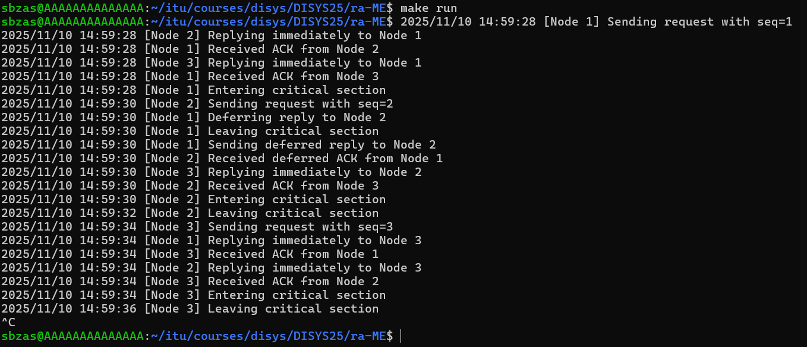

# Distributed Ricart-Agrawala Mutual Exclusion (execution instructions)

## 1. Getting ready

Compile `ra.proto` to generate the Go files that let us build our gRPC peer node instances.  

From the root folder (`DISYS25/ra-ME/`) run the following command on your terminal: 

`cd grpc && protoc --go_out=. --go-grpc_out=. ra.proto`

Lastly, to make sure you won't be getting compatibility errors with go modules run: `go mod tidy`

## 2. Executing the program

Running our implementation of the algorithm can be done in two simple steps: 

First, go back to the root folder by running: `cd ..`

Next, run: `make run`

That will take advantage of a small bash script we decided to write which acts as a sort automated service discovery, for ease of running our implementation. 

> **Note:** `make run` creates a hard limit on the amount of nodes in the network. By default, this amount is 3. Nevertheless, you can specify any amount `n` you'd like run the program with by turning the above command to: `make run NODES=n`

## 3. Checking logs and cleaning up

Once you start running the program you will see all logs getting printed to your terminal. They will indicate which node is being logged and the action they have performed (besides the default timestamps from Go's core log library).

Our implementation finishes when every node has entered the critical section once, so that you can safely interrupt execution when you don't see anything being printed to your terminal. 

> **Note:** After a run, you will have to run `make clean` if you wish to run the progam again. This will kill all opened ports and make them available again.

Here's a screenshot of a sample execution of our program with the default amount of nodes: 

 
